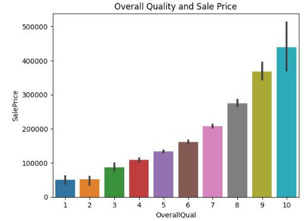
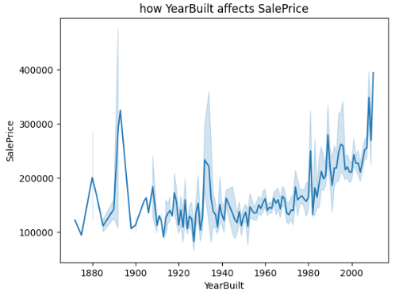
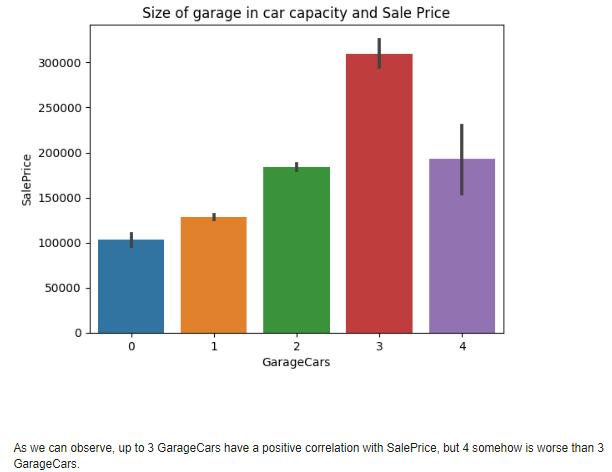
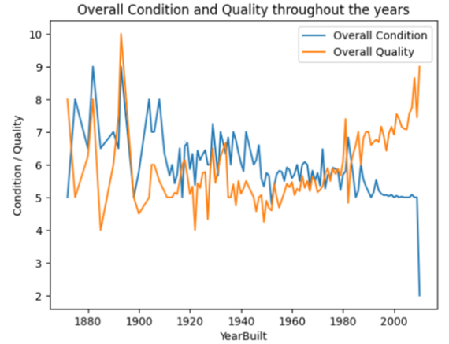
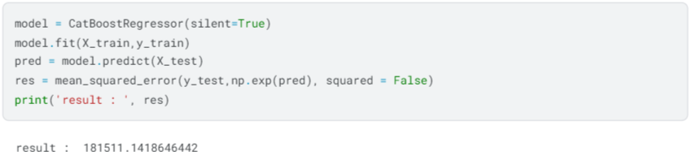
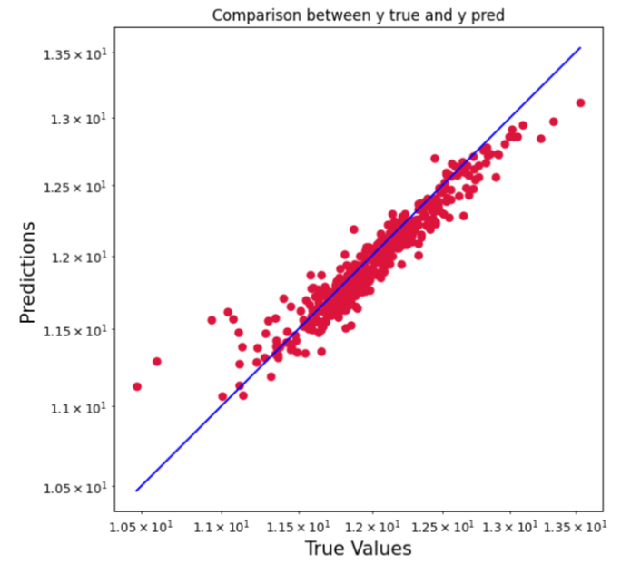
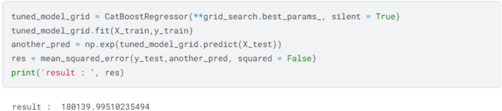

# House Pricing Forecast
Kaggle notebook source : https://www.kaggle.com/code/corneliuskarel/forecasting-house-pricing-with-boosting-algorithm

## Description

 The real estate market is highly dynamic, and accurate price forecasts are essential for buyers, sellers, and investors to optimize decisions. However, traditional methods often fail to capture the complexity of market trends. This project's goal is to predict house prices, offering insights to help stakeholders strategize effectively using machine learning algorithms.

## Business Problem

 This project aims to help stakeholders in real estate to make data-driven decisions. By analyzing historical data with relevant features (e.g., location, area, and amenities), This project leverages machine learning algorithms to predict house prices, offering insights to help stakeholders strategize effectively.

## Exploratory Data Analysis (EDA)
Exploratory Data Analysis to find insights from the dataset, using various visualization techniques and libraries, this component will be divided into 4 parts.

### How Overall Quality Affects Sale Price

 The chart shows a trend in here that higher 'OverallQual' leads to a higher 'SalePrice', it makes senses since quality do affects prices logically in most cases.

### How YearBuilt affects SalePrice

 The plot shows that houses built after 1980 tends to have higher sale price. There's also a spike of house prices between 1880-1900, assuming there was an economic event happening in between those years where house prices spiked.

### How the Size of Garage in Car Capacity affects Sale Price

The chart shows that, up to 3 GarageCars have a positive correlation with SalePrice, but 4 somehow is worse than 3 GarageCars.

### Overall Condition and Quality Analysis throughout the years

The assumption here was 'Overall Condition' and 'Overeall Quality' could have some similarity in values, which then we can combine both of these variables, since they have similar values. Turns out 'Overall Condition' and 'Overeall Quality' doesn't represent one another very well, as the lines can be easily distinguished from each other, therefore, we will not be combining both of them.¶

## Methodologies and Tuning
- **Handle Missing Values**: 
Imputation techniques were applied to fill in missing values for target columns based on the data card from the dataset. Some of the columns that have missing values have a meaning, for example in 'Alley' collumn, missing value means 'No Alley Access'. After filling the missing value accordingly to the data card, the rest of the missing value will be imputed using KNN Imputer, since the number of missing value is relatively small, KNN Imputer will not be computationaly expensive, therefore we will be using KNN Imputer.

- **Outlier Analysis and Handling**: 
Univariate outlier detection to find insights on how to handle it. The house pricing dataset contains few outliers throughout it's variables, however the algorithm that will be used are tree algorithms. Therefore, there is no need to impute or remove the outliers, in some cases where the algorithm is not robust to outliers and the outliers can't be dropped due to the data size, robust scaler can be used to reduce the outliers noise.

- **Feature Engineering** : 
Encoding ordinal variable using ordinal encoder and nominal variable using mean encoder to prevent curse of dimensionality and data overfitting.

- **Feature Selection**: 
Filtering highly constant features, since highly constant features hardly provides important information for machine learning algorithms to make forecasts.

- **Cross Validation**: 
Use cross validating technique to find the best machine learning model and deciding whether it is better to use scaled or unscaled data, for this project, we will be comparing few algorithms such as extreme gradient boosting(XGB), random forest, catboost, light gradient boosting(LGBM), and support vector regressor(SVR). 

- **Hyperparameter Tuning** : Use grid search for hyperparameter tuning and gets an improved Mean Squared Error(MSE) score. 

## Final Result 

### Pre tuned MSE result

High Precision and Recall score indicates that our model accurately makes correct prediction for every classes

### Pre tuned visualized result

High Precision and Recall score indicates that our model accurately makes correct prediction for every classes

### Post tuned MSE result

High Precision and Recall score indicates that our model accurately makes correct prediction for every classes

### Post tuned visualized result

High Precision and Recall score indicates that our model accurately makes correct prediction for every classes

